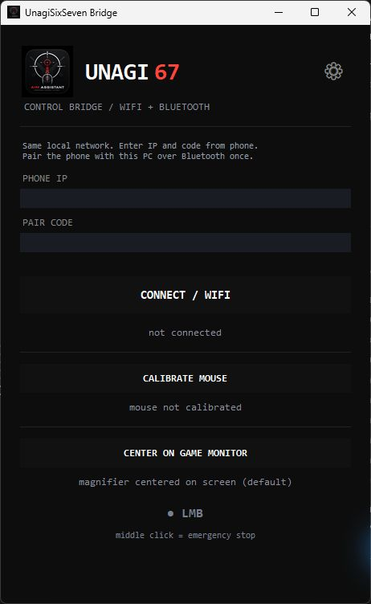

# UNAGI 67 — Downloads

[English](README.md) · [Русский](README.ru.md)

Android mouse-assistant control panel and Windows bridge using **Wi-Fi + Bluetooth HID**, with adjustable movement, repeated clicks and a centered screen magnifier. USB is not required for normal operation.

This repository contains ready-to-use packages, instructions and screenshots. Application source code is not included.

## Download v0.4

| Device | Download |
|---|---|
| Android 9+ with Bluetooth HID support | [Unagi67-WiFi.apk](downloads/Unagi67-WiFi.apk) |
| Windows x64 with Bluetooth | [Unagi67-Windows.zip](downloads/Unagi67-Windows.zip) |

On GitHub, open the file and choose **Download raw file** if a download does not start. [SHA-256 checksums](downloads/SHA256SUMS.txt).

**Extract the complete Windows ZIP**, then run `Unagi67_WiFi_Bridge.exe`. Keep `_internal` next to the EXE. Python does not need to be installed.

## Quick start

1. Install the APK and allow Bluetooth permissions. Notification permission exposes the background-service controls.
2. Connect the phone and PC to the same local network; the PC may use Ethernet.
3. Open the phone app and enter its Wi-Fi IP address and six-digit code in the Windows bridge.
4. Select **CONNECT / WIFI**. Keep or establish Bluetooth pairing between the phone and PC.
5. Select **CALIBRATE MOUSE**, click your physical left mouse button, then enable the desired phone modes.
6. For a second monitor, select **CENTER ON GAME MONITOR** and click anywhere on the target monitor.

**STOP** on the phone or the middle mouse button disables the modes. Connection loss also disables them. [Detailed instructions and troubleshooting](docs/SETUP.en.md).

## Screenshots

<table><tr><th>Android</th><th>Windows</th></tr><tr><td></td><td valign="top"></td></tr></table>

The Android screenshot is from a disposable emulator. Its IP addresses and code are test values; use those shown on your phone.

## Test status

This is a prototype/debug Android build. Startup, background TCP communication and STOP were tested in an emulator. Windows magnifier placement and zoom were tested. Physical-phone Bluetooth persistence, screen-off behavior, real Wi-Fi latency and individual games still need hardware testing. The magnifier targets monitor center, not the center of a small game window.

Android force-stop terminates the service. Manufacturer background restrictions may affect operation. Updating an existing APK requires a matching signing key. The control channel is intended for a trusted local network and is not encrypted.

No advertising is included.
