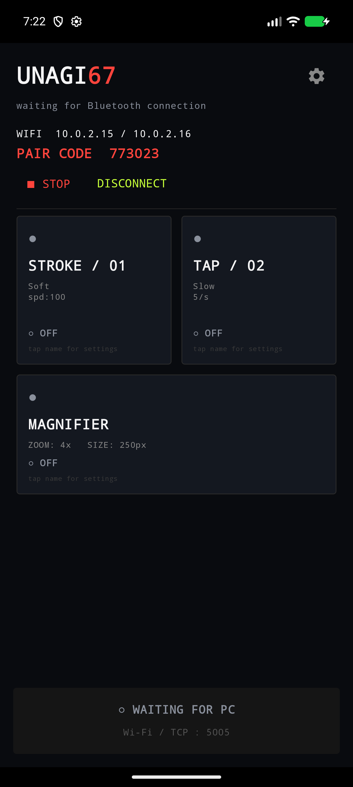
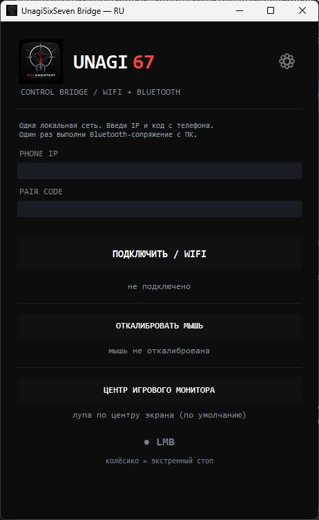

# UNAGI 67 — Скачать

[English](README.md) · [Русский](README.ru.md)

Ассистент мыши с пультом Android и Windows-программой по **Wi-Fi + Bluetooth HID**: настраиваемое движение, повторные клики и экранная лупа по центру. USB для обычной работы не нужен.

В репозитории только готовые программы, инструкции и скриншоты. Исходники приложения не включены.

## Скачать v0.4

| Устройство | Файл |
|---|---|
| Android 9+ с поддержкой Bluetooth HID | [Unagi67-WiFi.apk](downloads/Unagi67-WiFi.apk) |
| Windows x64 с Bluetooth | [Unagi67-Windows.zip](downloads/Unagi67-Windows.zip) |

Если GitHub открыл страницу файла, нажми **Download raw file** для скачивания. [Контрольные суммы SHA-256](downloads/SHA256SUMS.txt).

**Распакуй Windows ZIP целиком** и запусти `Unagi67_WiFi_Bridge.exe`. Папка `_internal` должна остаться рядом с EXE. Установка Python не требуется.

## Быстрый запуск

1. Установи APK и разреши Bluetooth. Разрешение уведомлений позволяет управлять фоновой службой из уведомления.
2. Подключи телефон и ПК к одной локальной сети; ПК может использовать Ethernet.
3. Открой приложение и введи показанные IP Wi-Fi и шестизначный код в Windows-программе.
4. Нажми **ПОДКЛЮЧИТЬ / WIFI**. Сохрани существующую Bluetooth-пару или выполни сопряжение телефона с ПК.
5. Нажми **ОТКАЛИБРОВАТЬ МЫШЬ**, затем ЛКМ физической мыши. Включи нужные режимы на телефоне.
6. Для другого экрана нажми **ЦЕНТР ИГРОВОГО МОНИТОРА** и кликни в любом месте этого монитора.

**STOP** на телефоне или средняя кнопка мыши выключает режимы. При потере связи они также выключаются. [Подробная инструкция и решение проблем](docs/SETUP.ru.md).

## Скриншоты

<table><tr><th>Android</th><th>Windows</th></tr><tr><td></td><td valign="top"></td></tr></table>

Экран Android снят в одноразовом эмуляторе. Адреса и код на нём тестовые — используй данные своего телефона.

## Что проверено

Это прототип с debug-сборкой Android. В эмуляторе проверены запуск, фоновое TCP-соединение и STOP; на Windows — положение лупы и увеличение. Bluetooth после сворачивания на физическом телефоне, выключенный экран, реальная задержка Wi-Fi и конкретные игры ещё требуют проверки. Лупа ориентируется на центр монитора, а не маленького окна игры.

Принудительная остановка Android завершает службу; ограничения прошивки также могут влиять на фон. Обновление существующего APK требует совпадения ключа подписи. Канал управления рассчитан на доверенную локальную сеть и не шифруется.

Рекламы нет.
